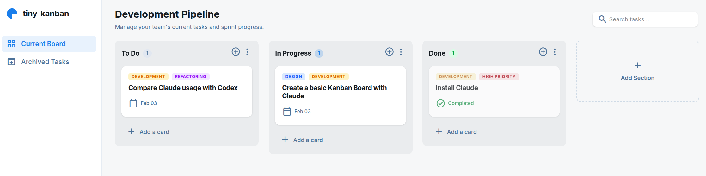
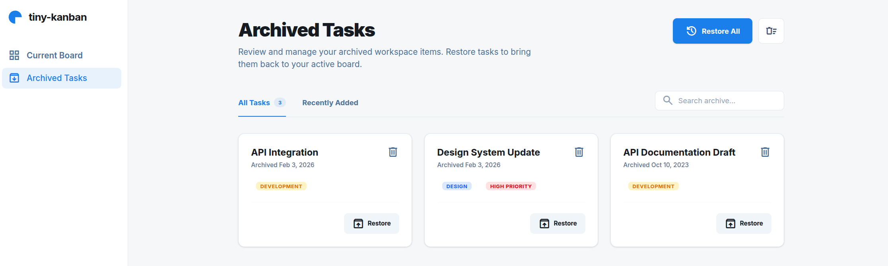

# tiny-kanban Kanban Board

[](https://opensource.org/licenses/MIT)

A full-stack Kanban board application with a Python/FastAPI backend and a React/TypeScript frontend, styled to match Google Stitch designs.





## ⚠️ Disclaimer

**This is a personal learning project** created for educational purposes and to experiment with AI-assisted development. It was built to:
- Explore full-stack development patterns
- Learn new technologies and frameworks
- Test AI development tools and workflows

**Use at your own risk.** While functional, this project is not intended for production use without proper review, testing, and security hardening. See the [LICENSE](LICENSE) for full terms.

## Development

This project was developed with assistance from Claude (Anthropic's AI assistant).
The stitch were made with Google Stitch.


## Tech Stack

**Backend:** Python 3.12+, FastAPI, SQLAlchemy 2.0 (async), Alembic, SQLite, Pydantic v2

**Frontend:** React 18, TypeScript, Vite, Tailwind CSS 4, @dnd-kit, React Router 6

## Project Structure

```
simple_kanban/
├── backend/
│   ├── app/
│   │   ├── main.py          # FastAPI app with CORS and lifespan
│   │   ├── config.py        # Settings
│   │   ├── database.py      # Async SQLAlchemy engine and session
│   │   ├── models.py        # ORM models (columns, cards, tags, card_tags)
│   │   ├── schemas.py       # Pydantic request/response models
│   │   ├── seed.py          # Demo data seeder
│   │   └── routers/         # API route handlers
│   └── tests/               # Async pytest test suite
├── frontend/
│   └── src/
│       ├── api/             # Fetch wrappers per resource
│       ├── types/           # TypeScript interfaces
│       ├── hooks/           # useColumns, useArchive, useTags
│       ├── components/      # layout, board, archive, shared
│       ├── pages/           # BoardPage, ArchivePage
│       └── __tests__/       # Vitest component tests
└── google_stitch/           # Design references
```

## Getting Started

### Database Setup

This project uses Alembic for database migrations.

**First Time Setup:**

```bash
cd backend
source .venv/bin/activate
pip install -e ".[dev]"
alembic upgrade head  # Create database tables
```

**⚠️ Warning about seed script**: The seed script deletes all existing data! For demo data, use a separate database:
```bash
SEED_DB=demo.db python -m app.seed --force
```
See `backend/DATABASE_SAFETY.md` for details.

**Development:**

Migrations run automatically on app startup. To disable:
```bash
AUTO_MIGRATE=false uvicorn app.main:app --reload
```

**Creating Migrations:**

After modifying `app/models.py`:
```bash
source .venv/bin/activate
alembic revision --autogenerate -m "your_description"
alembic upgrade head
```

See `backend/alembic/README.md` for detailed migration documentation.

### Environment Variables

Both backend and frontend support configurable ports via environment variables:

**Backend** (`backend/.env`):
- `BACKEND_PORT`: Backend server port (default: 8000)
- `FRONTEND_PORT`: Frontend port for CORS configuration (default: 5173)
- `DATABASE_URL`: Database connection string (default: sqlite+aiosqlite:///./taskflow.db)
- `AUTO_MIGRATE`: Auto-run migrations on startup (default: true)

**Frontend** (`frontend/.env`):
- `BACKEND_PORT`: Backend API port for proxy configuration (default: 8000)
- `FRONTEND_PORT`: Frontend dev server port (default: 5173)

Copy the example files to get started:
```bash
cp backend/.env.example backend/.env
cp frontend/.env.example frontend/.env
```

### Backend

```bash
cd backend
python -m venv .venv
source .venv/bin/activate
pip install -e ".[dev]"
```

[Optional] Seed the database with demo data:

```bash
python -m app.seed
```

Start the development server:

```bash
# Using uvicorn directly (uses default port 8000)
uvicorn app.main:app --reload

# Or use python to run with environment variables
python -m app.main
```

The API is available at `http://localhost:8000` with interactive docs at `/docs`.

### Frontend

```bash
cd frontend
npm install
npm run dev
```

The dev server runs at `http://localhost:5173` and proxies `/api` requests to the backend.

## Testing

### Backend

```bash
cd backend
source .venv/bin/activate
pytest -v
```

Linting:

```bash
black --check app/ tests/
pyflakes app/ tests/
```

### Frontend

```bash
cd frontend
npx vitest run
```

Linting and formatting:

```bash
npx eslint . --max-warnings 0
npx prettier --check 'src/**/*.{ts,tsx,css}'
```

## API Overview

All endpoints are under the `/api` prefix.

| Resource | Endpoints |
|----------|-----------|
| Columns | `GET /columns`, `POST /columns`, `PATCH /columns/:id`, `DELETE /columns/:id`, `PUT /columns/reorder` |
| Cards | `POST /columns/:id/cards`, `PATCH /cards/:id`, `DELETE /cards/:id`, `PUT /cards/move`, `POST /cards/:id/archive`, `POST /cards/:id/restore` |
| Archive | `GET /archive`, `POST /archive/restore-all`, `POST /archive/clear` |
| Tags | `GET /tags`, `POST /tags`, `DELETE /tags/:id` |
| Search | `GET /search?q=` |

## Key Features

- Drag-and-drop cards between columns using @dnd-kit
- Archive and restore cards (column deletion archives its cards)
- "Done" column styling with opacity, grayscale, and strikethrough
- Inline editing for column names and card details
- Tag management with color-coded badges
- Paginated archive with search
- Debounced board search

## License

This project is licensed under the MIT License - see the [LICENSE](LICENSE) file for details.
